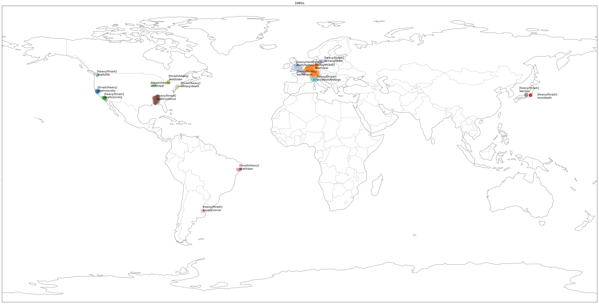
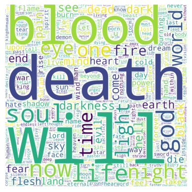

# STATS 102 Final Project: Text Analysis Based on the Metal-Archives

[Final Report](<1_Final Project Report.ipynb>)

This project analyzes patterns in the artists and songs on Metal-Archives with *scikit-learn*:
1.  **Clustering Bands:** Applying unsupervised methods to group over 160,000 bands based on genre, lyrical themes, and spatio-temporal data (founding year and location).
    

        
    

2.  **Predicting Genres:** Using song lyrics from over 3 million songs to train supervised models capable of predicting a song's genre.
    

        
    

# Components

## 1. Data Collection
* **Web Crawling:** Developed a custom web crawler to programmatically collect data from "the Metal-Archives".
* **Dataset:** Assembled a large dataset including band information (name, genre, themes, country, year founded) and song lyrics.

## 2. Unsupervised Learning: Clustering

This project explored three different clustering methodologies:

* **By Genre & Theme (K-Means):**
    * **Preprocessing:** Used `CountVectorizer` to tokenize and vectorize categorical text data from "genres" and "themes".
    * **Algorithm:** Implemented K-Means clustering due to the large dataset size.
    * **Model Selection:** Employed the **silhouette coefficient** to evaluate cluster performance. A final value of K=300 was chosen to balance interpretability and performance, achieving a strong silhouette score of approximately 0.8.

* **By Date & Location (DBSCAN):**
    * **Methodology:** Bands were first grouped by their founding decade and then clustered by location using DBSCAN, which is suitable for geospatial data.
    * **Analysis:** This spatio-temporal clustering successfully identified historical movements in metal music, such as the emergence of "heavy metal" in Western Europe and North America in the 1960s and the rise of Black Metal in Northern Europe in the 1990s. The results were found to be consistent with established music history.

## 3. Supervised Learning: Genre Prediction

* **Feature Engineering (TF-IDF):**
    * Raw song lyrics were processed using **TF-IDF (Term Frequency-Inverse Document Frequency)** to create a numerical feature matrix, reflecting the importance of each word to a given document.

* **Model Comparison & Evaluation:**
    * Treated the problem as a binary classification task for each genre, as songs can have multiple labels.
    * Evaluated multiple classifiers (Multinomial Naive Bayes, Logistic Regression, SVM, Decision Tree, K-Near Classifier).
    * Used the **Matthews Correlation Coefficient (MCC)** as the primary performance metric, as it is well-suited for imbalanced datasets.
    * **Result:** Multinomial Naive Bayes demonstrated the best performance with an MCC of 0.282.

* **Feature & Model Tuning:**
    * Tuned the number of features for the Multinomial Naive Bayes model, finding optimal performance (MCC ≈ 0.273) at approximately 1.4 million features.
    * Also explored sub-genre prediction within Black Metal using the same methodology.

# Conclusions
* **Clustering:** Unsupervised clustering proved effective. The K-Means model produced well-defined clusters (silhouette score ≈ 0.8), and the DBSCAN model's spatio-temporal results strongly aligned with documented music history.
* **Prediction:** The supervised models showed that Multinomial Naive Bayes was the best-performing algorithm for this task. However, the overall prediction accuracy was not very high, leading to the conclusion that the relevance between specific words in lyrics and a song's genre is relatively low.

# How to Run
Please see `readme.txt` for the correct order to run the code, as the analysis scripts are dependent on the data collection scripts.
